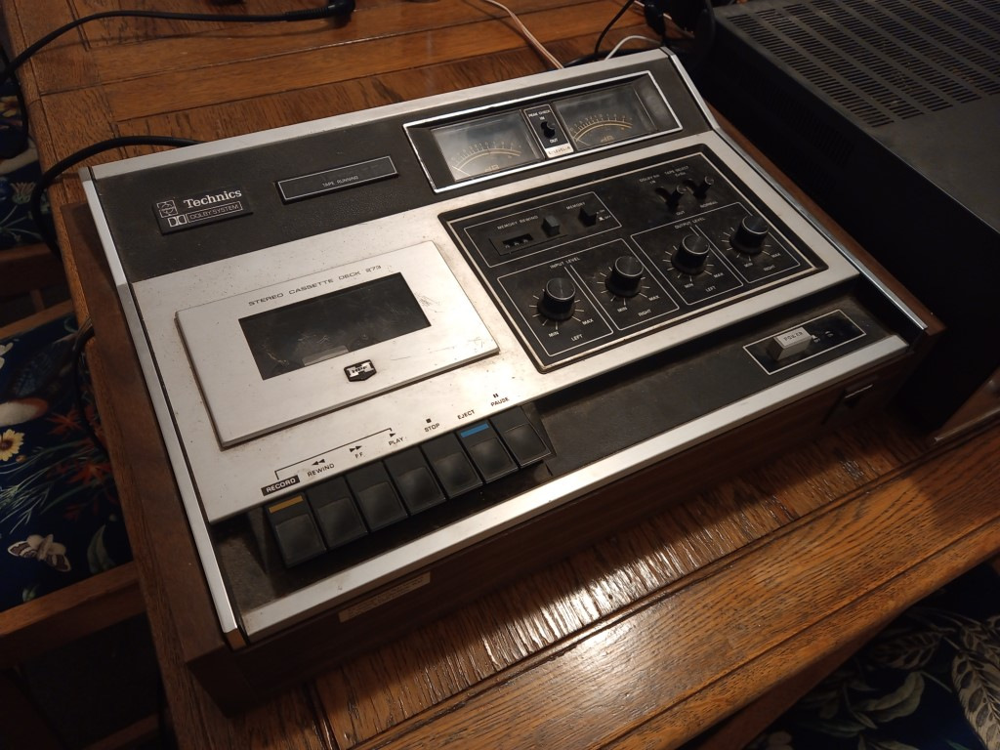
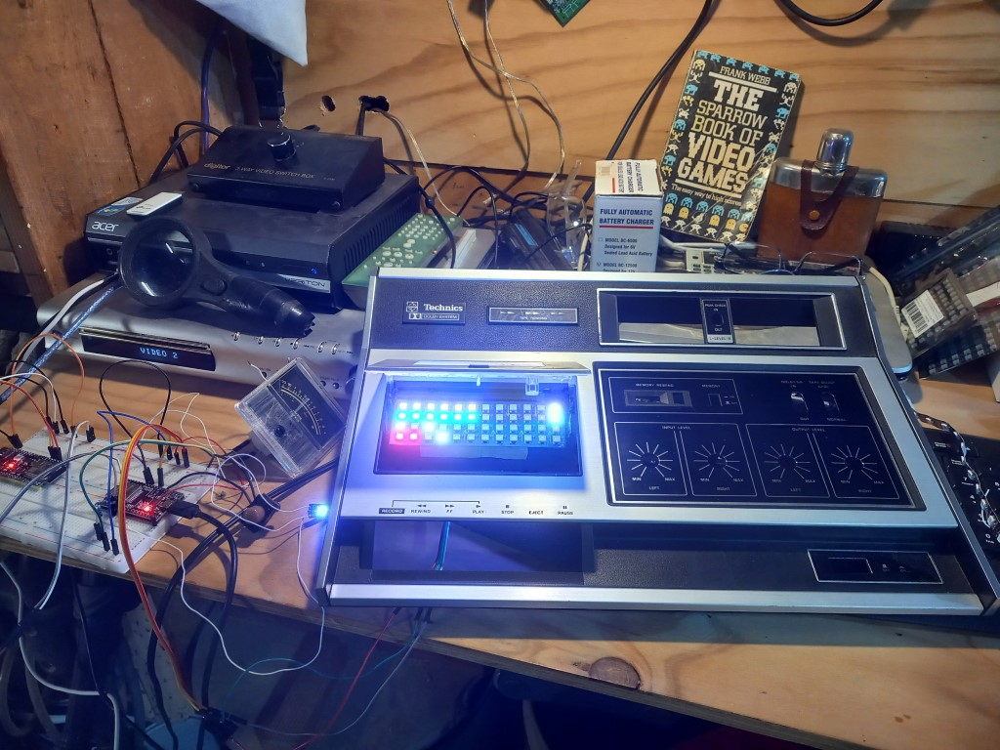

# VU Meter with 8x8 RGB graphics

## In progress...

This project is taking a 1971 Technics RS-273US tape deck and removing all the electronics and replacing it with more modern tech.

This includes two esp32s; one is used to generate music using https://github.com/andyvans/AcidBox and the other is used to analyse the audio using an FFT and display the results on an 12x4 RGB matrix and the original analog VU meters.

RGB LEDs have been added into the display and into the analog VU meters.

The motors have been removed, the potentiometers have been replaced with rotary encoders. All tape deck controls have microswitches added to them.

## Before

## Work in progress

## Notes

Comment out all code in .pio\libdeps\esp-wrover-kit\EasyButton\src\EasyButtonTouch.h to compile on esp32.